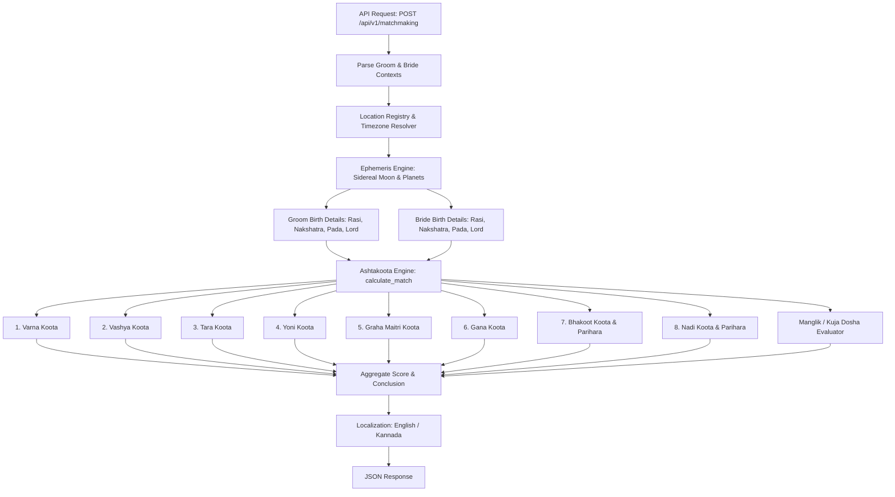

# Kundali Matchmaking (Ashtakoota Guna Milan) Specification v1.0

## Objective

Extend the **HoraJnana-REST-API** with support for comprehensive Vedic Kundali Matchmaking (**Ashtakoota Guna Milan / ಕುಂಡಲಿ ಮಿಲನ**). 

The new feature will accept the birth details (Name, Date of Birth, Time of Birth, and Place of Birth / Coordinates) of both the **Groom (Vara)** and the **Bride (Kanya)**, perform precise astronomical calculations using the Swiss Ephemeris sidereal engine, evaluate all 8 classical compatibility Kootas (totaling 36 Gunas), evaluate Doshas and Pariharas (Cancellations), and return a structured JSON response.

The feature exposes the following REST API endpoints:
- `POST /api/v1/matchmaking` (Primary JSON payload endpoint)
- `GET /api/v1/matchmaking` (Query parameter endpoint for testing and lightweight clients)

### Key Requirements & Principles
- **Astrological Rigor**: Implement authentic classical Vedic rules (Brihat Parashara Hora Shastra, Muhurta Chintamani, and Jataka Parijata) for all 8 Kootas: *Varna, Vashya, Tara, Yoni, Graha Maitri, Gana, Bhakoot, and Nadi*.
- **Dosha & Parihara (Exception) Handling**: Accurate detection of *Nadi Dosha*, *Bhakoot Dosha*, *Gana Dosha*, and their canonical cancellation conditions (*Pariharas*).
- **Manglik / Kuja Dosha Evaluation**: Optional complementary evaluation of Mars placement (1st, 2nd, 4th, 7th, 8th, 12th houses from Lagna and Moon) for both charts.
- **Maximal Reuse**: Leverage existing astronomical computation (`EphemerisEngine`), astrological helpers (`calculate_kundali`, `NAKSHATRAS`, `RASHIS`, `RASI_LORDS`), location resolution (`LocationRegistry`), timezone resolution (`TimezoneResolver`), and multi-language support (`localize_payload` for English and Kannada).
- **High Performance & Backward Compatibility**: Stateless, cached, rate-limited, and non-breaking to existing endpoints.

---

## Vedic Ashtakoota (8 Gunas) Calculation Rules

The Ashtakoota system assigns a total maximum score of **36 Gunas (Points)** distributed across 8 categories based on the natal Moon's sidereal longitude ($\lambda_M$), Rasi ($R$), Nakshatra ($N$), and Pada ($P$) of the Groom and Bride.

$$\text{Total Points} = \sum_{i=1}^{8} \text{Koota}_i = 1 + 2 + 3 + 4 + 5 + 6 + 7 + 8 = 36$$

```
+-----------------------------------------------------------------------------+
| # | Koota (English)   | Koota (Kannada) | Max Points | Signification        |
+---+-------------------+-----------------+------------+----------------------+
| 1 | Varna             | ವರ್ಣ            | 1          | Ego/Work Capacity    |
| 2 | Vashya            | ವಶ್ಯ            | 2          | Mutual Attraction    |
| 3 | Tara (Dina)       | ತಾರಾ (ದಿನ)       | 3          | Health & Destiny     |
| 4 | Yoni              | ಯೋನಿ            | 4          | Physical/Intimacy    |
| 5 | Graha Maitri      | ಗ್ರಹ ಮೈತ್ರಿ     | 5          | Mental/Psychological |
| 6 | Gana              | ಗಣ              | 6          | Temperament/Behavior |
| 7 | Bhakoot           | ಭಕೂಟ            | 7          | Family & Prosperity  |
| 8 | Nadi              | ನಾಡಿ            | 8          | Genetics & Progeny   |
+---+-------------------+-----------------+------------+----------------------+
|   | TOTAL             | ಒಟ್ಟು           | 36         |                      |
+-----------------------------------------------------------------------------+
```

---

### 1. Varna Koota (ವರ್ಣ ಕೂಟ) - 1 Point

Measures spiritual, ego, and intellectual compatibility based on the Moon Rasis.

#### Classification of Rasis into 4 Varnas:
| Varna | Rank | Rasis Included | Element |
|---|---|---|---|
| **Brahmin** (ಜ್ಞಾನ/ಆಧ್ಯಾತ್ಮ) | 4 | Cancer (Karka), Scorpio (Vrishchika), Pisces (Meena) | Water |
| **Kshatriya** (ನಾಯಕತ್ವ/ಶೌರ್ಯ) | 3 | Aries (Mesha), Leo (Simha), Sagittarius (Dhanu) | Fire |
| **Vaishya** (ವಾಣಿಜ್ಯ/ವ್ಯವಹಾರ) | 2 | Taurus (Vrishabha), Virgo (Kanya), Capricorn (Makara) | Earth |
| **Shudra** (ಸೇವೆ/ಶ್ರಮ) | 1 | Gemini (Mithuna), Libra (Tula), Aquarius (Kumbha) | Air |

#### Scoring Rules:
- If **$\text{Rank}(\text{Groom Varna}) \ge \text{Rank}(\text{Bride Varna})$**: **1.0 Point** (Favorable / ಅನುಕೂಲ)
- If **$\text{Rank}(\text{Groom Varna}) < \text{Rank}(\text{Bride Varna})$**: **0.0 Points** (Varna Dosha / ಅನನುಕೂಲ)

---

### 2. Vashya Koota (ವಶ್ಯ ಕೂಟ) - 2 Points

Measures mutual attraction, harmony, and natural balance of authority.

#### Classification of Rasis into 5 Vashya Categories:
1. **Chatushpada (ಚತುಷ್ಪಾದ - Quadruped)**: Aries (Mesha), Taurus (Vrishabha), Sagittarius 2nd half ($15^\circ - 30^\circ$), Capricorn 1st half ($0^\circ - 15^\circ$).
2. **Manava / Dwipada (ಮಾನವ / ದ್ವಿಪಾದ - Human)**: Gemini (Mithuna), Virgo (Kanya), Libra (Tula), Sagittarius 1st half ($0^\circ - 15^\circ$), Aquarius (Kumbha).
3. **Jalachara (ಜಲಚರ - Water-dweller)**: Cancer (Karka), Pisces (Meena), Capricorn 2nd half ($15^\circ - 30^\circ$).
4. **Vanachara / Simha (ವನಚರ / ಸಿಂಹ - Forest Predator)**: Leo (Simha).
5. **Keeta (ಕೀಟ - Insect)**: Scorpio (Vrishchika).

#### Classical Compatibility Scoring Matrix:
- Same Vashya group: **2.0 Points**
- Mutual Vashya (Controlled/Amenable): **1.0 Point**
- One-way Vashya / Neutral: **0.5 Points**
- Inimical / Food-Predator relationship (e.g. Leo with Chatushpada/Manava): **0.0 Points**

*(A standard 12x12 precalculated lookup table between Groom Rasi and Bride Rasi will be used for deterministic calculation).*

---

### 3. Tara / Dina Koota (ತಾರಾ / ದಿನ ಕೂಟ) - 3 Points

Measures destiny, health, longevity, and mutual auspiciousness derived from birth Nakshatras.

#### Calculation Steps:
1. Determine the 9-Tara position for Groom and Bride in the 27 Nakshatras cycle ($1$ to $9$):
   $$T_{\text{groom}} = (N_{\text{groom\_idx}} \bmod 9) + 1$$
   $$T_{\text{bride}} = (N_{\text{bride\_idx}} \bmod 9) + 1$$
   *(where $N_{\text{idx}} \in [0, 26]$ is the 0-indexed Nakshatra number)*.

#### 9 Tara Classifications:
| $T$ | Tara Name | Kannada | Auspicious? | Nature |
|---|---|---|---|---|
| 1 | **Janma** | ಜನ್ಮ | **No** (except same Nakshatra) | Body / Health Vulnerability |
| 2 | **Sampat** | ಸಂಪತ್ | **Yes** (Auspicious) | Wealth & Prosperity |
| 3 | **Vipat** | ವಿಪತ್ | **No** (Inauspicious) | Danger & Losses |
| 4 | **Kshema** | ಕ್ಷೇಮ | **Yes** (Auspicious) | Well-being & Security |
| 5 | **Pratyak** | ಪ್ರತ್ಯಕ್ | **No** (Inauspicious) | Obstacles & Disputes |
| 6 | **Sadhana** | ಸಾಧನಾ | **Yes** (Auspicious) | Success & Fulfillment |
| 7 | **Vadha / Naidhana** | ವಧ / ನೈಧನ | **No** (Inauspicious) | Destruction / Severe harm |
| 8 | **Mitra** | ಮಿತ್ರ | **Yes** (Auspicious) | Friendship & Happiness |
| 9 | **Parama Mitra** | ಪರಮ ಮಿತ್ರ | **Yes** (Auspicious) | Supreme Ally & Support |

#### Scoring Rules:
- Auspicious Taras (1.5 pts each): $\{2, 4, 6, 8, 9\}$ (and $1$ if both share the exact same Janma Nakshatra $\rightarrow 3.0$ pts).
- Inauspicious Taras (0 pts each): $\{1, 3, 5, 7\}$.
- If **both $T_{\text{groom}}$ and $T_{\text{bride}}$ are auspicious**: **3.0 Points**
- If **one is auspicious and one inauspicious**: **1.5 Points**
- If **both are inauspicious**:
  - **Tara Dosha Parihara**: If the Nakshatra lords of Groom and Bride are **mutual friends or identical**, Tara Dosha is mitigated $\implies \mathbf{1.5\text{ Points}}$ (`parihara_applied = true`).
  - Otherwise $\implies \mathbf{0.0\text{ Points}}$ (`parihara_applied = false`).


---

### 4. Yoni Koota (ಯೋನಿ ಕೂಟ) - 4 Points

Measures biological, physical, sexual harmony, and instinctive attraction.

#### 14 Animal Yonis of the 27 Nakshatras:
| Animal Yoni | Kannada | Nakshatras Assigned |
|---|---|---|
| **Horse (Ashwa)** | ಅಶ್ವ | Ashwini, Shatabhisha |
| **Elephant (Gaja)** | ಗಜ | Bharani, Revati |
| **Sheep / Goat (Mesha)** | ಮೇಷ | Krittika, Pushya |
| **Serpent (Sarpa)** | ಸರ್ಪ | Rohini, Mrigashira |
| **Dog (Shwana)** | ಶ್ವಾನ | Ardra, Mula |
| **Cat (Marjara)** | ಮಾರ್ಜಾಲ | Punarvasu, Ashlesha |
| **Rat (Mushaka)** | ಮೂಷಕ | Magha, Purva Phalguni |
| **Cow (Gau)** | ಗೋವು | Uttara Phalguni, Uttara Bhadrapada |
| **Buffalo (Mahisha)** | ಮಹಿಷ | Hasta, Swati |
| **Tiger (Vyaghra)** | ವ್ಯಾಗ್ರ | Chitra, Vishakha |
| **Deer (Mriga)** | ಮೃಗ | Anuradha, Jyeshtha |
| **Monkey (Vanara)** | ವಾನರ | Purva Ashadha, Shravana |
| **Mongoose (Nakula)** | ನಕುಲ | Uttara Ashadha |
| **Lion (Simha)** | ಸಿಂಹ | Dhanishtha, Purva Bhadrapada |

#### Classical 14x14 Yoni Compatibility Matrix (Rows = Bride, Columns = Groom):
| # | Bride \ Groom | Horse | Elephant | Sheep | Serpent | Dog | Rat | Cat | Tiger | Buffalo | Deer | Cow | Mongoose | Monkey | Lion |
|---|---|:---:|:---:|:---:|:---:|:---:|:---:|:---:|:---:|:---:|:---:|:---:|:---:|:---:|:---:|
| **1** | **Horse (ಕುದುರೆ)** | 4.0 | 2.0 | 3.0 | 2.0 | 2.0 | 3.0 | 3.0 | 1.0 | 0.0 | 3.0 | 3.0 | 2.0 | 2.0 | 1.0 |
| **2** | **Elephant (ಆನೆ)** | 2.0 | 4.0 | 3.0 | 2.0 | 2.0 | 3.0 | 3.0 | 1.0 | 3.0 | 3.0 | 3.0 | 2.0 | 2.0 | 0.0 |
| **3** | **Sheep (ಕುರಿ)** | 3.0 | 3.0 | 4.0 | 2.0 | 2.0 | 3.0 | 3.0 | 1.0 | 3.0 | 3.0 | 3.0 | 2.0 | 0.0 | 1.0 |
| **4** | **Serpent (ಹಾವು)** | 2.0 | 2.0 | 2.0 | 4.0 | 2.0 | 1.0 | 1.0 | 2.0 | 2.0 | 2.0 | 2.0 | 0.0 | 1.0 | 2.0 |
| **5** | **Dog (ನಾಯಿ)** | 2.0 | 2.0 | 2.0 | 2.0 | 4.0 | 2.0 | 1.0 | 2.0 | 2.0 | 0.0 | 2.0 | 2.0 | 2.0 | 2.0 |
| **6** | **Rat (ಇಲಿ)** | 3.0 | 3.0 | 3.0 | 1.0 | 2.0 | 4.0 | 0.0 | 2.0 | 3.0 | 3.0 | 3.0 | 1.0 | 2.0 | 1.0 |
| **7** | **Cat (ಬೆಕ್ಕು)** | 3.0 | 2.0 | 3.0 | 1.0 | 1.0 | 0.0 | 4.0 | 2.0 | 3.0 | 3.0 | 3.0 | 2.0 | 2.0 | 2.0 |
| **8** | **Tiger (ಹುಲಿ)** | 1.0 | 3.0 | 1.0 | 2.0 | 2.0 | 2.0 | 2.0 | 4.0 | 1.0 | 1.0 | 0.0 | 2.0 | 2.0 | 3.0 |
| **9** | **Buffalo (ಎಮ್ಮೆ)** | 0.0 | 3.0 | 3.0 | 2.0 | 2.0 | 3.0 | 3.0 | 1.0 | 4.0 | 3.0 | 3.0 | 2.0 | 2.0 | 3.0 |
| **10** | **Deer (ಜಿಂಕೆ)** | 3.0 | 3.0 | 3.0 | 2.0 | 0.0 | 2.0 | 3.0 | 1.0 | 3.0 | 4.0 | 3.0 | 2.0 | 2.0 | 1.0 |
| **11** | **Cow (ಹಸು)** | 3.0 | 3.0 | 3.0 | 2.0 | 2.0 | 3.0 | 3.0 | 0.0 | 3.0 | 3.0 | 4.0 | 2.0 | 2.0 | 1.0 |
| **12** | **Mongoose (ಕೀರ)** | 2.0 | 2.0 | 2.0 | 0.0 | 2.0 | 1.0 | 2.0 | 2.0 | 2.0 | 2.0 | 2.0 | 4.0 | 2.0 | 2.0 |
| **13** | **Monkey (ಕಪಿ)** | 2.0 | 2.0 | 0.0 | 2.0 | 2.0 | 2.0 | 2.0 | 2.0 | 2.0 | 2.0 | 2.0 | 2.0 | 4.0 | 2.0 |
| **14** | **Lion (ಸಿಂಹ)** | 1.0 | 0.0 | 1.0 | 1.0 | 2.0 | 2.0 | 2.0 | 3.0 | 1.0 | 1.0 | 1.0 | 2.0 | 2.0 | 4.0 |

*Sworn Enemy Pairs (0.0 Pts)*:
- Cow $\leftrightarrow$ Tiger, Elephant $\leftrightarrow$ Lion, Horse $\leftrightarrow$ Buffalo, Dog $\leftrightarrow$ Deer, Serpent $\leftrightarrow$ Mongoose, Monkey $\leftrightarrow$ Sheep, Cat $\leftrightarrow$ Rat.

---

### 5. Graha Maitri / Rasyadhipati (ಗ್ರಹ ಮೈತ್ರಿ ಕೂಟ) - 5 Points

Measures mental compatibility, intellectual outlook, and natural friendship of Moon sign lords.

#### Naisargika Sambandha (Natural Planetary Relationships):
| Planet | Natural Friends (ಮಿತ್ರರು) | Neutrals (ಸಮರು) | Natural Enemies (ಶತ್ರುಗಳು) |
|---|---|---|---|
| **Sun (ಸೂರ್ಯ)** | Moon, Mars, Jupiter | Mercury | Venus, Saturn |
| **Moon (ಚಂದ್ರ)** | Sun, Mercury | Mars, Jupiter, Venus, Saturn | *None* |
| **Mars (ಕುಜ)** | Sun, Moon, Jupiter | Venus, Saturn | Mercury |
| **Mercury (ಬುಧ)** | Sun, Venus | Mars, Jupiter, Saturn | Moon |
| **Jupiter (ಗುರು)** | Sun, Moon, Mars | Saturn | Mercury, Venus |
| **Venus (ಶುಕ್ರ)** | Mercury, Saturn | Mars, Jupiter | Sun, Moon |
| **Saturn (ಶನಿ)** | Mercury, Venus | Jupiter | Sun, Moon, Mars |

#### Scoring Rules between Groom Rasi Lord ($L_G$) and Bride Rasi Lord ($L_B$):
- Both are mutual friends or same lord: **5.0 Points**
- One friend, one neutral: **4.0 Points**
- Both are mutual neutrals: **3.0 Points**
- One friend, one enemy: **1.0 Point**
- One neutral, one enemy: **0.5 Points**
- Both are mutual enemies: **0.0 Points**

---

### 6. Gana Koota (ಗಣ ಕೂಟ) - 6 Points

Measures temperament, behavior, psychic wavelength, and life philosophy.

#### 3 Gana Categories:
1. **Deva Gana (ದೇವ ಗಣ - Divine/Virtuous)**: Ashwini, Mrigashira, Punarvasu, Pushya, Hasta, Swati, Anuradha, Shravana, Revati.
2. **Manushya Gana (ಮನುಷ್ಯ ಗಣ - Human/Practical)**: Bharani, Rohini, Ardra, Purva Phalguni, Uttara Phalguni, Purva Ashadha, Uttara Ashadha, Purva Bhadrapada, Uttara Bhadrapada.
3. **Rakshasa Gana (ರಾಕ್ಷಸ ಗಣ - Dominant/Aggressive)**: Krittika, Ashlesha, Magha, Chitra, Vishakha, Jyeshtha, Mula, Dhanishtha, Shatabhisha.

#### Scoring Rules (Classical Tradition: Rows = Bride, Columns = Groom):
| Bride Gana (ಸ್ತ್ರೀ) | Groom Gana (ವರ) | Points | Evaluation |
|---|---|:---:|---|
| Deva | Deva | **6.0** | Excellent (ಉತ್ತಮ) |
| Deva | Manushya | **4.0** | Moderate (ಮಧ್ಯಮ) |
| Deva | Rakshasa | **2.0** | Gana Dosha (Mitigated to 2 pts) |
| Manushya | Deva | **5.0** | Good (ಉತ್ತಮ / ಮಧ್ಯಮ) |
| Manushya | Manushya | **6.0** | Excellent (ಉತ್ತಮ) |
| Manushya | Rakshasa | **1.0** | Gana Dosha (Mitigated to 1 pt) |
| Rakshasa | Deva | **0.0** | Gana Dosha (ಅಧಮ) |
| Rakshasa | Manushya | **0.0** | Gana Dosha (ಅಶುಭ) |
| Rakshasa | Rakshasa | **6.0** | Excellent (ಉತ್ತಮ) |

---

### 7. Bhakoot / Rasi Koota (ಭಕೂಟ ಕೂಟ) - 7 Points

Measures family welfare, financial growth, marital longevity, and emotional bonding based on relative Rasi distance.

Let distance of Groom's Rasi from Bride's Rasi be $D_{B \to G}$ and Bride's Rasi from Groom's Rasi be $D_{G \to B}$.

#### Angular Relationships:
- **1/1 (Same Rasi)**: **7.0 Points** (Auspicious, provided Nakshatras differ or match auspiciously)
- **1/7 (Sama-Saptaka - 7th/7th)**: **7.0 Points** (Highly Auspicious)
- **3/11 (Triteeya-Ekadasha - 3rd/11th)**: **7.0 Points** (Auspicious - Friendship & Gains)
- **4/10 (Chaturtha-Dashama - 4th/10th)**: **7.0 Points** (Auspicious - Domestic happiness)
- **5/9 (Navama-Panchama - 5th/9th)**: **0.0 Points** (**Bhakoot Dosha** - Progeny/Dharma friction)
- **2/12 (Dvidvadasha - 2nd/12th)**: **0.0 Points** (**Bhakoot Dosha** - Financial distress/friction)
- **6/8 (Shadashtaka - 6th/8th)**: **0.0 Points** (**Bhakoot Dosha** - Health problems/conflict)

#### Bhakoot Dosha Parihara (Astrological Mitigation):
In the standard Ashtakoota 36-Guna scoring table, the three inauspicious placements (2/12, 5/9, and 6/8) receive **0.0 Points**. However, the negative impact of Bhakoot Dosha is astrologically cancelled / mitigated (`parihara_applied = true`) in consultation when:
1. Both Rasis have the **same lord** (e.g. Aries-Scorpio ruled by Mars, Taurus-Libra ruled by Venus).
2. The Rasi lords of both signs are **mutual friends** (e.g. Pisces-Aries ruled by Jupiter & Mars, Gemini-Libra ruled by Mercury & Venus, Taurus-Gemini ruled by Venus & Mercury).

---

### 8. Nadi Koota (ನಾಡಿ ಕೂಟ) - 8 Points

The most crucial Koota (holding 8 of 36 points). Measures genetic compatibility, health of progeny, physiological harmony, and Ayurvedic bio-energy (Vata, Pitta, Kapha).

#### 3 Nadis across 27 Nakshatras:
| Nadi | Bio-Temperament | Nakshatras |
|---|---|---|
| **Adi (ಆದಿ / Vata)** | Air / Nervous system | Ashwini, Ardra, Punarvasu, Uttara Phalguni, Hasta, Jyeshtha, Mula, Shatabhisha, Purva Bhadrapada |
| **Madhya (ಮಧ್ಯ / Pitta)** | Fire / Metabolic | Bharani, Mrigashira, Pushya, Purva Phalguni, Chitra, Anuradha, Purva Ashadha, Dhanishtha, Uttara Bhadrapada |
| **Antya (ಅಂತ್ಯ / Kapha)** | Water / Lymphatic | Krittika, Rohini, Ashlesha, Magha, Swati, Vishakha, Uttara Ashadha, Shravana, Revati |

#### Scoring Rules:
- **Different Nadi** (e.g. Groom Adi, Bride Madhya): **8.0 Points** (Auspicious / ಪ್ರಶಸ್ತ)
- **Same Nadi** (e.g. Groom Madhya, Bride Madhya): **0.0 Points** (**Nadi Dosha / ಮಹಾ ನಾಡಿ ದೋಷ**)

#### Nadi Dosha Parihara (Cancellation Exceptions):
In the standard Ashtakoota 36-Guna table, same Nadi receives **0.0 Points**. However, the evil effects of Nadi Dosha are astrologically cancelled / mitigated (`parihara_applied = true`) in consultation when:
1. **Same Rasi, Different Nakshatra**: Groom and Bride share the same Moon sign, but have different birth stars.
2. **Same Nakshatra, Different Rasi**: The birth star is identical, but spans across sign boundaries with Groom and Bride in different Rasis (e.g. Krittika in Aries vs Taurus, Mrigashira in Taurus vs Gemini, Chitra in Virgo vs Libra, Vishakha in Libra vs Scorpio, Uttarashadha in Sagittarius vs Capricorn, Dhanishtha in Capricorn vs Aquarius).
3. **Same Nakshatra, Different Padas with Auspicious Rasi Lord**: Specifically when Padas are different within the same birth star.

---

## Final Score Categorization

$$\text{Obtained Points} = \sum_{i=1}^8 \text{Koota Score}_i$$

| Score Range | Category (English) | Category (Kannada) | Match Verdict |
|---|---|---|---|
| **28.0 - 36.0** | **Uttama (Excellent)** | ಉತ್ತಮ (ಅತ್ಯುತ್ತಮ ಹೊಂದಾಣಿಕೆ) | Highly Recommended |
| **18.0 - 27.5** | **Madhyama (Good / Moderate)** | ಮಧ್ಯಮ (ಉತ್ತಮ ಹೊಂದಾಣಿಕೆ) | Approved for Marriage |
| **0.0 - 17.5** | **Adhama (Inauspicious / Poor)** | ಅಧಮ (ಹೊಂದಾಣಿಕೆ ಕಡಿಮೆ) | Not Recommended |

*Special Rule*: Even if the total score is $\ge 18$, if **unmitigated Nadi Dosha** or **unmitigated Bhakoot Dosha** exists, the response flags a prominent warning.

---

## Complementary Feature: Manglik / Kuja Dosha Analysis

In traditional matchmaking, Guna Milan is accompanied by Manglik (Kuja) Dosha analysis.
- **Kuja Dosha Check**: Evaluates whether Mars occupies the **1st, 2nd, 4th, 7th, 8th, or 12th** house from the Lagna (Ascendant) or the Moon.
- **Compatibility**: If both Groom and Bride are Manglik, or neither is Manglik, the Dosha is mutually balanced (*Sama Kuja Dosha*).

---

## Architectural Design & Reuse Strategy



### Components Reused from Codebase:
1. **`hora_server.astronomy.ephemeris.EphemerisEngine`**: Computes precise sidereal Moon and planetary positions for both Groom and Bride birth instants using high-precision Swiss Ephemeris.
2. **`hora_server.astrology.kundali.calculate_kundali`**: Used for Lagna calculation and Mars house placement for Manglik analysis.
3. **`hora_server.registry.LocationRegistry`**: Resolves place names (`groom.pob` / `bride.pob` such as `"Bengaluru"`, `"Mysuru"`, `"Mumbai"`).
4. **`hora_server.utils.timezone.TimezoneResolver`**: Resolves IANA timezone keys for each coordinates pair.
5. **`hora_server.astrology.constants`**: Uses standard constants `NAKSHATRAS`, `ENGLISH_RASIS`, `RASI_LORDS`, `PLANET_BODIES`.
6. **`hora_server.utils.translation.localize_payload`**: Translates output strings and descriptions to Kannada when `lang=kan`.

---

## API Endpoint Specification

### 1. `POST /api/v1/matchmaking`

Calculates Ashtakoota compatibility from structured JSON.

#### Request Headers
```http
Content-Type: application/json
```

#### Request JSON Body Schema
```json
{
  "groom": {
    "name": "Arjun",
    "dob": "1995-05-15",
    "tob": "08:30:00",
    "pob": "Bengaluru",
    "lat": 12.9716,
    "lon": 77.5946,
    "timezone": "Asia/Kolkata"
  },
  "bride": {
    "name": "Sneha",
    "dob": "1997-11-20",
    "tob": "14:15:00",
    "pob": "Mysuru",
    "lat": 12.2958,
    "lon": 76.6394,
    "timezone": "Asia/Kolkata"
  },
  "ayanamsa": "lahiri",
  "lang": "en",
  "include_manglik": true
}
```

*Notes on input fields*:
- `dob` format: `YYYY-MM-DD`
- `tob` format: `HH:MM[:SS]`
- `pob`: City name (resolved via `LocationRegistry`). Alternatively, direct `lat` and `lon` can be supplied.
- `ayanamsa`: Optional, defaults to `"lahiri"` (supported: `"lahiri"`, `"raman"`, `"kp"`, `"tropical"`).
- `lang`: Optional, `"en"` (default) or `"kan"`.

---

### 2. `GET /api/v1/matchmaking`

Lightweight query-parameter-based endpoint for simple GET requests.

#### Query Parameters
- `groom_name`, `groom_dob`, `groom_tob`, `groom_pob` (or `groom_lat`, `groom_lon`, `groom_tz`)
- `bride_name`, `bride_dob`, `bride_tob`, `bride_pob` (or `bride_lat`, `bride_lon`, `bride_tz`)
- `ayanamsa` (optional, default `"lahiri"`)
- `lang` (optional, default `"en"`)
- `include_manglik` (optional boolean, default `true`)

---

### JSON Response Schema

```json
{
  "ayanamsa": "Lahiri",
  "groom_info": {
    "name": "Arjun",
    "datetime": "1995-05-15T08:30:00+05:30",
    "location": "Bengaluru (12.9716, 77.5946)",
    "moon_rasi": "Vrishabha",
    "moon_rasi_lord": "Venus",
    "nakshatra": "Rohini",
    "nakshatra_number": 4,
    "nakshatra_lord": "Moon",
    "pada": 2,
    "varna": "Vaishya",
    "vashya": "Chatushpada",
    "yoni": "Serpent",
    "gana": "Manushya",
    "nadi": "Antya"
  },
  "bride_info": {
    "name": "Sneha",
    "datetime": "1997-11-20T14:15:00+05:30",
    "location": "Mysuru (12.2958, 76.6394)",
    "moon_rasi": "Karka",
    "moon_rasi_lord": "Moon",
    "nakshatra": "Pushya",
    "nakshatra_number": 8,
    "nakshatra_lord": "Saturn",
    "pada": 3,
    "varna": "Brahmin",
    "vashya": "Jalachara",
    "yoni": "Sheep",
    "gana": "Deva",
    "nadi": "Madhya"
  },
  "guna_milan": {
    "total_points": 28.5,
    "max_points": 36.0,
    "percentage": 79.17,
    "result": "Uttama",
    "is_recommended": true,
    "summary_message": "Excellent match with strong emotional, biological, and genetic harmony."
  },
  "kootas": {
    "varna": {
      "name": "Varna",
      "obtained_points": 0.0,
      "max_points": 1.0,
      "groom_attribute": "Vaishya",
      "bride_attribute": "Brahmin",
      "is_favorable": false,
      "dosha": "Varna Dosha",
      "description": "Groom's Varna is lower than Bride's Varna."
    },
    "vashya": {
      "name": "Vashya",
      "obtained_points": 1.0,
      "max_points": 2.0,
      "groom_attribute": "Chatushpada",
      "bride_attribute": "Jalachara",
      "is_favorable": true,
      "dosha": null,
      "description": "Moderate mutual attraction and amenability."
    },
    "tara": {
      "name": "Tara (Dina)",
      "obtained_points": 3.0,
      "max_points": 3.0,
      "groom_tara": "Kshema",
      "bride_tara": "Sampat",
      "is_favorable": true,
      "dosha": null,
      "description": "Both Tara alignments are auspicious, supporting health and prosperity."
    },
    "yoni": {
      "name": "Yoni",
      "obtained_points": 2.5,
      "max_points": 4.0,
      "groom_attribute": "Serpent",
      "bride_attribute": "Sheep",
      "is_favorable": true,
      "dosha": null,
      "description": "Compatible animal yonis with peaceful biological harmony."
    },
    "graha_maitri": {
      "name": "Graha Maitri",
      "obtained_points": 5.0,
      "max_points": 5.0,
      "groom_attribute": "Venus",
      "bride_attribute": "Moon",
      "is_favorable": true,
      "dosha": null,
      "description": "Planetary lords are mutual friends, fostering deep mental understanding."
    },
    "gana": {
      "name": "Gana",
      "obtained_points": 5.0,
      "max_points": 6.0,
      "groom_attribute": "Manushya",
      "bride_attribute": "Deva",
      "is_favorable": true,
      "dosha": null,
      "description": "Harmonious temperament between Manushya and Deva Ganas."
    },
    "bhakoot": {
      "name": "Bhakoot",
      "obtained_points": 4.0,
      "max_points": 7.0,
      "groom_attribute": "Vrishabha (2nd)",
      "bride_attribute": "Karka (4th)",
      "is_favorable": true,
      "dosha": null,
      "parihara_applied": false,
      "description": "3/11 relationship promoting marital happiness and growth."
    },
    "nadi": {
      "name": "Nadi",
      "obtained_points": 8.0,
      "max_points": 8.0,
      "groom_attribute": "Antya",
      "bride_attribute": "Madhya",
      "is_favorable": true,
      "dosha": null,
      "parihara_applied": false,
      "description": "Different Nadis provide optimal genetic diversity and progeny health."
    }
  },
  "doshas_summary": {
    "has_nadi_dosha": false,
    "has_bhakoot_dosha": false,
    "has_gana_dosha": false,
    "dosha_details": []
  },
  "manglik_analysis": {
    "groom_manglik": {
      "is_manglik": false,
      "status": "Non-Manglik",
      "mars_house_lagna": 9,
      "mars_house_moon": 11
    },
    "bride_manglik": {
      "is_manglik": false,
      "status": "Non-Manglik",
      "mars_house_lagna": 3,
      "mars_house_moon": 5
    },
    "manglik_compatibility": "Compatible",
    "description": "Neither partner has Kuja Dosha. The match is mutually balanced."
  }
}
```

---

## Planned Implementation Structure

```
hora_server/
├── astrology/
│   ├── matchmaking.py       # [NEW] Pure Ashtakoota calculation engine, rules, matrices, Pariharas
│   └── constants.py         # Update with Varna, Vashya, Yoni, Gana, Nadi tables
├── api/
│   ├── matchmaking.py       # [NEW] Flask API blueprint for POST & GET /matchmaking
│   └── __init__.py          # Register matchmaking blueprint
├── service.py               # Add PanchangaService.matchmaking() integration
├── utils/
│   └── translation.py       # Add Kannada translations for all Ashtakoota terms
tests/
└── test_matchmaking.py      # [NEW] Full test suite covering 36-point calculations, doshas, pariharas, API
```

---

## Verification & Test Plan

1. **Unit Tests for Ashtakoota Logic**:
   - Verify each of the 8 Kootas individually against classical textbook benchmarks.
   - Verify Nadi Dosha detection and Parihara conditions.
   - Verify Bhakoot Dosha detection and cancellation conditions.
2. **Integration Tests**:
   - Test `POST /api/v1/matchmaking` with valid JSON payload, city name resolution, and ISO datetimes.
   - Test `GET /api/v1/matchmaking` with query parameters.
   - Test Kannada localization (`lang=kan`).
   - Test error handling for missing inputs, invalid dates, out-of-range years, and invalid coordinates.
